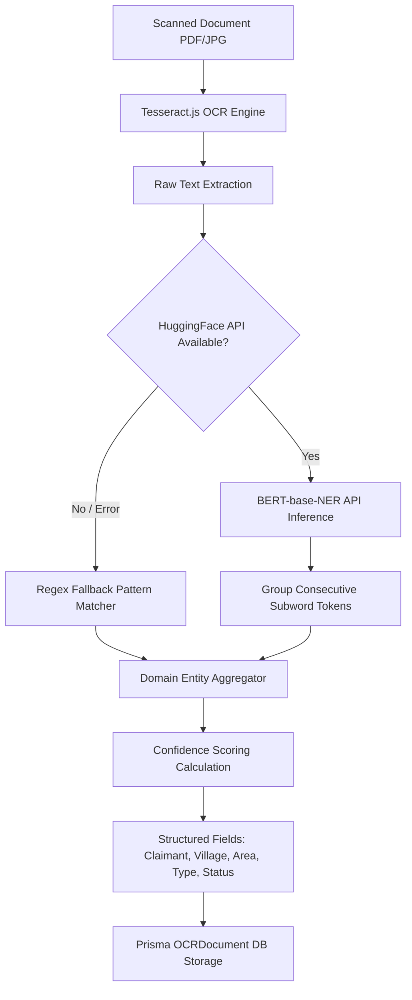
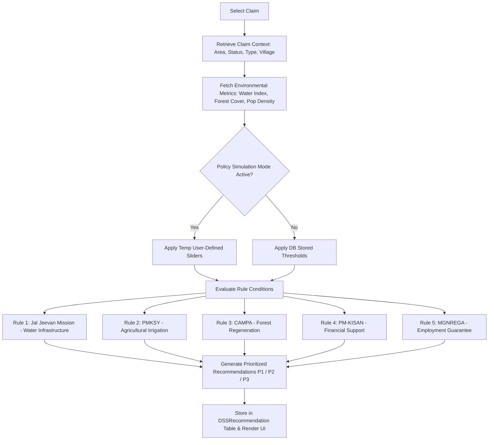

# 🌲 BharatAtlas (FRA Atlas & Decision Support System) — Comprehensive Project Architecture & Feature Specification

> **Document Purpose**: This comprehensive specification provides an exhaustive, end-to-end breakdown of the entire **BharatAtlas (FRA Atlas & DSS v2.0)** portfolio project. It is structured to serve as an authoritative technical and functional blueprint that any developer or AI model can consume to rebuild the entire application from scratch with 90%–100% feature parity.

---

## 📑 Table of Contents
1. [Executive Summary & Problem Statement](#1-executive-summary--problem-statement)
2. [Complete Technology Stack & Architecture Overview](#2-complete-technology-stack--architecture-overview)
3. [Database Schema & Data Model Deep Dive](#3-database-schema--data-model-deep-dive)
4. [Application Routing & Navigation Blueprint](#4-application-routing--navigation-blueprint)
5. [Module-by-Module Feature Breakdown](#5-module-by-module-feature-breakdown)
   - [5.1 Landing Page (`/landing` & `/`)](#51-landing-page-landing--)
   - [5.2 Authentication & Security Layer (Clerk Middleware)](#52-authentication--security-layer-clerk-middleware)
   - [5.3 FRA Atlas & Indian Map Pinpointing Engine (`/atlas`)](#53-fra-atlas--indian-map-pinpointing-engine-atlas)
   - [5.4 Document Upload, OCR & NER Extraction (`/upload`)](#54-document-upload-ocr--ner-extraction-upload)
   - [5.5 AI Satellite Asset Mapping (`/asset-mapping`)](#55-ai-satellite-asset-mapping-asset-mapping)
   - [5.6 Decision Support System (DSS) Rule Engine & Policy Simulation (`/dss`)](#56-decision-support-system-dss-rule-engine--policy-simulation-dss)
   - [5.7 Executive Analytics Dashboard (`/dashboard`)](#57-executive-analytics-dashboard-dashboard)
   - [5.8 FRA Digital Claims Archive & Filtering Engine (`/archive`)](#58-fra-digital-claims-archive--filtering-engine-archive)
   - [5.9 Administrative Management & Mini-Map Pinpointer (`/admin`)](#59-administrative-management--mini-map-pinpointer-admin)
6. [Backend API Routes & Request/Response Contracts](#6-backend-api-routes--requestresponse-contracts)
7. [AI, Machine Learning & Rule Algorithms](#7-ai-machine-learning--rule-algorithms)
8. [Map & GIS Mechanics (Pinpointing, Geocoding & Layers)](#8-map--gis-mechanics-pinpointing-geocoding--layers)
9. [Step-by-Step Blueprint to Rebuild from Scratch](#9-step-by-step-blueprint-to-rebuild-from-scratch)

---

## 1. Executive Summary & Problem Statement

### 1.1 The Domain: The Scheduled Tribes and Other Traditional Forest Dwellers (Recognition of Forest Rights) Act, 2006 (FRA)
The Forest Rights Act (FRA) in India recognizes the rights of forest-dwelling tribal communities and other traditional forest dwellers to forestland and resources.
There are three fundamental claim types:
1. **IFR (Individual Forest Rights)**: Recognition of individual tribal families' rights over cultivable forest land (up to 4 hectares).
2. **CR (Community Rights)**: Recognition of community customary rights over minor forest produce (MFP), grazing grounds, water bodies, and cultural sites.
3. **CFR (Community Forest Resource Rights)**: Protection, regeneration, conservation, and sustainable management rights over traditional community forest resources.

### 1.2 The System: BharatAtlas
Historically, FRA claims were paper-heavy, poorly mapped, and took months or years to verify, approve, and link with central/state government welfare schemes. 

**BharatAtlas** is an AI-powered WebGIS platform designed to solve these bottlenecks:
- **Digitizes paper claims** via Tesseract OCR + HuggingFace NER entity extraction.
- **Plots claims and community assets** on an interactive Indian GIS map powered by MapLibre GL with multiple satellite, topographic, and street layers.
- **Analyzes satellite imagery** for automatic land-use classification (agriculture, forest, water bodies, human settlements).
- **Automates decision support (DSS)** by applying rule-based algorithms to recommend appropriate welfare schemes (PM-KISAN, Jal Jeevan Mission, MGNREGA, CAMPA, Eklavya Schools) based on claim size, forest cover, and water indices.
- **Maintains a digital archive** with multi-parameter search and CSV export for governance auditing.

---

## 2. Complete Technology Stack & Architecture Overview

| Layer | Technologies Used | Rationale / Function |
| :--- | :--- | :--- |
| **Framework** | **Next.js 15 (App Router)** | Fullstack React framework with Server Components, API routes, and streaming support. |
| **Language** | **TypeScript 5** | Strict type safety for data models, API payloads, and GIS GeoJSON coordinates. |
| **Styling & UI** | **Tailwind CSS v4**, Radix UI primitives, Lucide React, Geist font | Rapid styling with custom gradient tokens (`bg-gradient-orange-white`, `bg-gradient-green-white`), micro-animations (`animate-fade-in`, `card-enhanced`). |
| **Authentication** | **Clerk (`@clerk/nextjs`)** | User registration, login, session tokens, and route protection via `clerkMiddleware`. |
| **Database & ORM** | **PostgreSQL (Neon Serverless)** with **Prisma ORM (v6.16)** | Relational database modeling with schema migrations, relational indexing, and JSON fields for GeoJSON points. |
| **Mapping & GIS** | **MapLibre GL JS**, `@maplibre/maplibre-gl-geocoder` | Client-side vector/raster map rendering, OSM raster tiles, Esri Satellite, OpenTopoMap, Nominatim Indian geocoder. |
| **OCR (Optical Character Recognition)** | **Tesseract.js (v4.0)** | Client/Node.js browser-compatible optical character extraction from uploaded scans/images. |
| **NER (Named Entity Recognition)** | **HuggingFace Inference API** (`dslim/bert-base-NER`) + Regex fallback | Natural language entity extraction for claimants, locations, areas, and claim types. |
| **Satellite Asset Classification** | Custom Computer Vision abstraction (`lib/ai-classification.ts`) | Simulates/interfaces with Random Forest/CNN models to detect water, forest, settlements, and cropland. |
| **Client State / Fetching** | **SWR** (`stale-while-revalidate`) | Auto-caching, mutation, polling intervals, and real-time refresh across dashboards and archives. |

---

## 3. Database Schema & Data Model Deep Dive

The database utilizes PostgreSQL via Prisma. Here is the exact structure of all primary entities:

```prisma
model User {
  id        String   @id @default(cuid())
  clerkId   String   @unique
  email     String
  createdAt DateTime @default(now())
  updatedAt DateTime @updatedAt
  claims    Claim[]
}

model Claim {
  id           Int                 @id @default(autoincrement())
  claimant     String              // Claimant identifier/code (e.g. "CLM-2024-001")
  claimantName String              // Full name of applicant (e.g. "Ramesh Munda")
  village      String              // Village name
  district     String              // District name
  type         String              // "IFR", "CR", or "CFR"
  area         Float               // Land size in hectares
  status       String              // "Pending", "Granted", or "Rejected"
  coords       Json                // GeoJSON format: { type: "Point", coordinates: [longitude, latitude] }
  nerData      Json?               // Raw entities extracted by NER (persons, locations, etc.)
  updatedAt    DateTime            @updatedAt
  createdAt    DateTime            @default(now())
  userId       String?
  user         User?               @relation(fields: [userId], references: [id])
  dss          DSSRecommendation[]
}

model Asset {
  id        Int      @id @default(autoincrement())
  type      String   // "water", "forest", "agriculture", "settlement"
  coords    Json     // GeoJSON: { type: "Point", coordinates: [lng, lat] }
  village   String?  // Associated village
  source    String   // "Manual" (admin entered) or "Satellite" (AI detected)
  name      String?  // Human-readable asset name (e.g., "Panchayat Pond")
  owner     String?  // Owner name or community entity
  createdAt DateTime @default(now())
}

model DSSRecommendation {
  id        Int      @id @default(autoincrement())
  claimId   Int
  scheme    String   // Recommended government scheme (e.g., "Jal Jeevan Mission", "PM-KISAN")
  reason    String   // Rule explanation justifying the recommendation
  priority  Int      @default(1) // 1 = High, 2 = Medium, 3 = Low
  createdAt DateTime @default(now())
  claim     Claim    @relation(fields: [claimId], references: [id])
}

model OCRDocument {
  id          Int      @id @default(autoincrement())
  filename    String
  rawText     String   @db.Text
  nerEntities Json     // Formatted NER output
  processed   Boolean  @default(false)
  claimId     Int?
  createdAt   DateTime @default(now())
}

model DSSRule {
  id        Int      @id @default(autoincrement())
  name      String
  condition String   // Stored rule expression / JSON condition
  action    String   // Action or scheme to apply
  priority  Int      @default(1)
  active    Boolean  @default(true)
  createdAt DateTime @default(now())
  updatedAt DateTime @updatedAt
}

model PolicyThreshold {
  id          Int      @id @default(autoincrement())
  parameter   String   @unique // e.g. "water_index", "forest_cover", "max_area_ha"
  value       Float    // Dynamic numeric threshold
  unit        String?  // e.g. "hectares", "ratio", "per km²"
  description String?
  updatedAt   DateTime @updatedAt
}
```

---

## 4. Application Routing & Navigation Blueprint

| Route | Page File | Access Level | Description |
| :--- | :--- | :--- | :--- |
| `/` | `app/page.tsx` | Public | Automatic redirect or gateway directly forwarding to `/landing`. |
| `/landing` | `app/landing/page.tsx` | Public | High-impact promotional hero section, feature cards, and quick start links. |
| `/sign-in` | `app/sign-in/[[...sign-in]]/page.tsx` | Public | Clerk pre-built secure sign-in widget. |
| `/sign-up` | `app/sign-up/[[...sign-up]]/page.tsx` | Public | Clerk pre-built secure user registration widget. |
| `/atlas` | `app/atlas/page.tsx` | Protected | Full-screen interactive WebGIS map of India with layer toggle, search, and pins. |
| `/upload` | `app/upload/page.tsx` | Protected | Document file uploader with OCR extraction, entity preview, and claim conversion. |
| `/asset-mapping` | `app/asset-mapping/page.tsx` | Protected | Upload satellite GeoTIFF/PNGs to run AI computer vision land-use classification. |
| `/dss` | `app/dss/page.tsx` | Protected | Policy simulation playground, rule evaluation engine, and CSV export. |
| `/dashboard` | `app/dashboard/page.tsx` | Protected | Executive dashboard with KPIs, district bar charts, asset pies, and progress bars. |
| `/archive` | `app/archive/page.tsx` | Protected | Comprehensive searchable claims table with multi-attribute filtering & pagination. |
| `/admin` | `app/admin/page.tsx` | Protected | Administration dashboard with interactive mini-map pinpointer for claims and assets. |

---

## 5. Module-by-Module Feature Breakdown

### 5.1 Landing Page (`/landing` & `/`)
- **Visual Presentation**: Styled with national Indian tri-color accents (deep saffron/orange `#ea580c` and forest green `#16a34a`), background forest overlay, and responsive image collage showcasing community forest lands.
- **Hero & Navigation**:
  - Displays greeting personalized with the user's name via Clerk's `currentUser()`.
  - Feature Grid Cards for all 6 major sub-systems: Dashboard, Upload Docs, BharatAtlas, DSS Engine, Digital Archive, and Admin Panel.
  - Call-to-action buttons: "Explore Atlas" (direct to `/atlas`) and "Upload Document" (direct to `/upload`).

---

### 5.2 Authentication & Security Layer (Clerk Middleware)
- **Middleware implementation (`middleware.ts`)**:
  - Configured with `clerkMiddleware({ publicRoutes: ["/sign-in(.*)", "/sign-up(.*)"] })`.
  - Matches all root routes and API endpoints, redirecting unauthenticated users to `/sign-in`.
- **Identity Context**:
  - Automatically associates claims created through the API with the authenticated Clerk user's ID (`clerkId` / `userId`).

---

### 5.3 FRA Atlas & Indian Map Pinpointing Engine (`/atlas`)
The Atlas is the flagship geospatial module centered on the Indian subcontinent.

#### A. Map Viewport & Base Layers
- Centered at coordinates `[77.0, 20.0]` (the geographic center of India) at default Zoom Level `5`.
- Dynamic multi-layer tile switcher between:
  1. **OpenStreetMap (`osm-standard`)**: Standard street raster tiles (`https://tile.openstreetmap.org/{z}/{x}/{y}.png`).
  2. **Esri World Imagery (`esri-satellite`)**: High-resolution optical satellite imagery (`https://server.arcgisonline.com/ArcGIS/rest/services/World_Imagery/MapServer/tile/{z}/{y}/{x}`).
  3. **Topographic Map (`osm-terrain`)**: Contour and elevation mapping via OpenTopoMap (`https://tile.opentopomap.org/{z}/{x}/{y}.png`).

#### B. Indian Place Geocoder (Search Bar)
- Embedded `@maplibre/maplibre-gl-geocoder` docked in the **top-left corner**.
- Integrates with OpenStreetMap's Nominatim geocoding engine with the parameter `countrycodes=in` to restrict all searches strictly within Indian territory (districts, tehsils, villages, and landmarks).
- Typing 3+ characters triggers live forward-geocoding; selecting a result flies the camera to the coordinate and drops a locator pin.

#### C. Pinpointing & Dual-Marker System
The map simultaneously renders two distinct categories of data points:
1. **Forest Rights Claims Markers**:
   - **Color-Coded by Status**:
     - 🟢 **Green** (`#22c55e`): Granted / Approved claims.
     - 🔴 **Red** (`#ef4444`): Rejected claims.
     - 🔵 **Blue** (`#3b82f6`): Pending review.
   - **Interactive Hover Cards**: Hovering over any claim pin displays a dark micro-card showing Claimant Name, Village, Claim Type, and Status badge.
   - **Clickable Detail Modal/Popup**: Clicking a pin opens a detailed modal showing:
     - Claim ID
     - Claimant Full Name
     - Village & District
     - Land Classification (IFR, CR, CFR)
     - Application Status
2. **Community Forest Asset Markers**:
   - Smaller dot markers color-coded by asset type:
     - 💧 **Cyan** (`#06b6d4`): Water bodies, ponds, wells, canals.
     - 🌲 **Emerald** (`#059669`): Forest areas, sacred groves, NTFP collection zones.
     - 🌾 **Yellow** (`#eab308`): Agricultural land, shifting cultivation plots.
     - 🏘️ **Gray** (`#6b7280`): Settlements, tribal hamlets (*paras/tolas*).
     - 🟣 **Purple**: Other public amenities.
   - Clicking reveals the asset name, village name, and ownership record.

#### D. Live Filter Toolbar (Header Panel)
- **Claim Type filter**: All, IFR, CR, CFR.
- **Claim Status filter**: All, Granted, Pending, Rejected.
- **Village filter**: Dynamically populated from all unique villages existing in the database.
- **Layer Toggle switches**: Checkboxes to toggle Claims on/off and Assets on/off independently.

---

### 5.4 Document Upload, OCR & NER Extraction (`/upload`)
Enables non-technical field workers or tribal welfare officers to photograph or scan physical title applications and convert them into structured digital records.

#### A. Document Processing Pipeline
1. **File Input**: Accepts PDF, JPEG, and PNG document scans.
2. **OCR Engine (Tesseract.js)**:
   - Runs server-side (`app/api/upload/route.ts`).
   - Extracts complete raw text stream with confidence score logging.
3. **Named Entity Recognition (NER Pipeline)**:
   - Calls HuggingFace Transformer model `dslim/bert-base-NER` using API token.
   - Extracts `B-PER` / `I-PER` (person names), `B-LOC` / `I-LOC` (locations), and `B-ORG` (institutions).
   - **Regex Fallback Engine**: If HuggingFace is offline or unconfigured, fallback regex extractors parse Indian naming patterns (`Shri`, `Smt`, `Applicant: ...`), village keywords (`Gram`, `Panchayat`, `District`), and legal terms (`Hectares`, `ha`, `IFR`, `CFR`).
4. **Structured Field Mapping**:
   - Automatically populates:
     - Claimant Name
     - Village / Gram Panchayat
     - Land Type (IFR / CR / CFR)
     - Claimed Area (in hectares)
     - Status (defaults to Pending)
     - Coordinates (if present in the document text)
   - Computes an aggregate **Confidence Score** (0% to 100%).

#### B. Review & 1-Click Save
- Displays a three-column split view:
  1. **Extracted Fields Box**: Editable fields with confidence percentage tag.
  2. **Identified NER Entities Box**: Categorized pills of detected people, locations, and organizations.
  3. **Raw Text Viewer**: Scrollable terminal-style box showing the raw OCR transcription.
- Clicking **"Save as Claim"** dispatches a `POST /api/claims` payload, permanently storing the digitized document and claim in the database.

---

### 5.5 AI Satellite Asset Mapping (`/asset-mapping`)
Allows government operators to upload aerial satellite tiles and automatically detect, measure, and inventory natural assets.

- **Upload & Geo-Referencing**:
  - Accepts GeoTIFF, PNG, or JPG satellite imagery.
  - Form field takes the bounding box coordinates: `minLng, minLat, maxLng, maxLat` (e.g. `77.0, 20.0, 77.1, 20.1`) and Village name.
- **Computer Vision Classification Pipeline (`lib/ai-classification.ts`)**:
  - Computes the total ground coverage area in square kilometers.
  - Detects spatial features and computes spectral signatures across Red, Green, Blue, and Near-Infrared (NIR) bands.
  - Classifies features into **agriculture**, **forest**, **water**, or **settlement**.
  - Automatically generates latitude/longitude coordinates and polygon square meter sizes for each asset with 70%–100% confidence.
- **Output & Persistence**:
  - High-confidence assets are automatically saved to the database `Asset` table with `source = "Satellite"`.
  - Displays land-use distribution percentages and a list of all detected features.

---

### 5.6 Decision Support System (DSS) Rule Engine & Policy Simulation (`/dss`)
The DSS translates raw land rights approvals into actionable socio-economic welfare delivery.

#### A. Rule Engine Logic (`lib/dss-engine.ts`)
Evaluates claim conditions against Indian central & state welfare policies:
1. **Jal Jeevan Mission (Water Scarcity Rule)**:
   - *Condition*: Status == `Granted` AND Area > `0.5 ha` AND Water Availability Index < `Threshold (0.5)`
   - *Action*: Priority 1 recommendation to construct community water infrastructure / tap connections.
2. **PM Krishi Sinchayee Yojana (Agricultural Irrigation Rule)**:
   - *Condition*: Water Index < `Threshold` AND Claim Type in `["IFR", "Agricultural"]`
   - *Action*: Priority 2 recommendation for drip irrigation and farm pond subsidies.
3. **CAMPA Forest Conservation & Regeneration**:
   - *Condition*: Forest Cover Ratio > `Threshold (0.4)` AND Claim Type in `["IFR", "CFR"]` AND Status == `Granted`
   - *Action*: Priority 2 allocation under the Compensatory Afforestation Fund Management and Planning Authority.
4. **PM-KISAN Samman Nidhi (Farmer Income Support)**:
   - *Condition*: Status == `Granted` AND Area between `minAreaHa (0.5 ha)` and `maxAreaHa (4.0 ha)` AND Type in `["IFR", "Agricultural"]`
   - *Action*: Priority 1 direct benefit financial income transfer for agricultural inputs.
5. **MGNREGA Employment Guarantee Scheme**:
   - *Condition*: Population Density < `Threshold (150/km²)` AND Status == `Granted`
   - *Action*: Priority 1 allocation for land leveling, bunding, and rural road creation.
6. **Eklavya Model Residential Schools (Tribal Education)**:
   - *Condition*: Type in `["CR", "CFR"]` AND Population Density > `Threshold`
   - *Action*: Priority 2 infrastructure recommendation for tribal children's education centers.

#### B. Dynamic Policy Simulation Mode
- A toggle switch activates **"Policy Simulation Mode"**.
- Administrators can adjust policy threshold sliders in real-time without modifying the live database:
  - Water Index Threshold (0.0 to 1.0)
  - Forest Cover Ratio (0.0 to 1.0)
  - Max Land Area (1 to 10 ha)
  - Min Land Area (0.1 to 2 ha)
  - Population Density (50 to 500 per km²)
- Re-running evaluation tests "What-If" scenarios to project budget allocations and eligible beneficiary counts before policy enactment.

#### C. Statistical Analytics & Reporting
- Priority Distribution counters (Priority 1 High, Priority 2 Medium, Priority 3 Low).
- Top Schemes Bar rankings.
- **Export to CSV**: Generates timestamped `.csv` files of all recommendations with claim cross-references for district magistrate review.

---

### 5.7 Executive Analytics Dashboard (`/dashboard`)
Designed for District Collectors, State Welfare Ministers, and Tribal Affairs Officers to assess programmatic progress.

- **KPI Cards**:
  - **Total Claims**: Overall volume of claims received.
  - **Pending Review**: Claims awaiting gram sabha / sub-divisional committee verification.
  - **Approved Claims**: Percentage approval rate and total granted titles.
  - **Forest Assets**: Total mapped geographic assets.
- **Interactive Visualizations**:
  - **Claims by District (Top 10)**: Horizontal bar chart showing district-level distribution.
  - **Asset Distribution by Type**: Categorical breakdown of water, forest, agriculture, and settlement counts.
  - **Monthly Claims Trend**: Historical intake and resolution volume across chronological months.
  - **Recent Claims Activity Feed**: Live stream showing the latest submitted claims, status badges, and districts.
- **Target Progress Bars**:
  - Claims Digitization Target (e.g. 1,240 / 10,000 claims - 12.4% complete).
  - Asset Mapping Target (e.g. 850 / 5,000 assets).
  - Statewide Target Approval Rate indicator.

---

### 5.8 FRA Digital Claims Archive & Filtering Engine (`/archive`)
A high-throughput searchable repository for legal case verification and audits.

- **Multi-Parameter Search Bar**: Real-time full-text search querying claimant name, village, claim type, or status.
- **Advanced Filter Tray**:
  - Village name
  - Claim Type (`IFR`, `CR`, `CFR`)
  - Status (`Granted`, `Pending`, `Rejected`)
  - Date Range (`Date From` to `Date To`)
  - Area Range (`Min Area` and `Max Area` in hectares)
- **Pagination Controls**: Full server-side pagination with `Previous`, `Next`, and page counters.
- **Feature Indicators**: Badges denoting whether a claim was extracted via OCR (`OCR`) or has generated DSS policies (`DSS(n)`).
- **Bulk CSV Export**: Generates complete Excel/CSV sheets of the active filtered query.

---

### 5.9 Administrative Management & Mini-Map Pinpointer (`/admin`)
An operations console allowing administrators to manually inject, edit, and audit records.

- **Interactive Mini-Map Pinpointer (`MiniMapSelector`)**:
  - Solves the problem of entering raw latitude/longitude coordinates manually.
  - Embeds an interactive pop-out satellite map directly inside the claim/asset creation forms.
  - Includes a localized Indian search bar (Nominatim geocoder).
  - Features a **draggable green marker**: dragging the pin or clicking anywhere on the map dynamically writes the exact coordinates (`[longitude, latitude]`) with 6 decimal precision into the form state.
- **Direct Claim Entry Form**: Manual entry of Claimant ID, Full Name, Village, District, Land Type, Hectares, Status, and Pinpoint Location.
- **Direct Asset Entry Form**: Register community assets with Type, Owner, Village, Source ("Manual" vs "Satellite"), and Coordinates.
- **AI-Detected Assets Summary**: Summary widget displaying cards for AI-classified satellite assets.
- **Master Data Tables**: Full inspection table with row-by-row visibility of all claims and assets in the database.

---

## 6. Backend API Routes & Request/Response Contracts

### 6.1 Claims Endpoints
- **`GET /api/claims`**:
  - *Response*: Array of `Claim` objects.
- **`POST /api/claims`**:
  - *Payload*: `{ claimant, claimantName, village, district, type, area, status, coords, nerData? }`
  - *Response*: Newly created `Claim` record.
- **`GET /api/claims/search`**:
  - *Query Params*: `q`, `village`, `type`, `status`, `dateFrom`, `dateTo`, `minArea`, `maxArea`, `page`, `limit`
  - *Response*: `{ claims: Claim[], pagination: { page, limit, totalCount, totalPages, hasNext, hasPrev } }`
- **`GET /api/claims/stats`**:
  - *Response*: Overall archive statistics, total area, average area, type breakdown, and village distribution.

### 6.2 Asset Endpoints
- **`GET /api/assets`**:
  - *Response*: Array of all mapped assets.
- **`POST /api/assets`**:
  - *Payload*: `{ name, owner?, type, village?, source, coords }`
  - *Response*: Newly created `Asset` record.

### 6.3 Document Processing & AI Endpoints
- **`POST /api/upload`**:
  - *Payload*: `multipart/form-data` containing `file` (PDF or image).
  - *Processing*: Executes Tesseract OCR -> HuggingFace/Regex NER -> Parses structured fields -> Creates `OCRDocument` row.
  - *Response*: `{ text, fields: { claimant, village, area, type, status, coordinates, confidence }, nerEntities, documentId }`
- **`POST /api/ai-classify`**:
  - *Payload*: `{ imageData: base64, bounds: [minLng, minLat, maxLng, maxLat], village, model }`
  - *Processing*: Analyzes spectral signatures and generates detected land-use polygons. High-confidence assets are inserted into the `Asset` table.
  - *Response*: `{ totalDetected, savedAssets, analysis: SatelliteImageAnalysis }`

### 6.4 Decision Support System Endpoints
- **`GET /api/dss`**:
  - *Response*: Array of existing `DSSRecommendation` records joined with claim data.
- **`POST /api/dss/evaluate`**:
  - *Payload*: `{ claimId: number, thresholds?: PolicyThresholds }`
  - *Processing*: Loads claim context, applies dynamic or database thresholds, executes rule conditions, and persists recommendations.
  - *Response*: `{ success: true, recommendations: DSSRecommendation[] }`
- **`GET /api/dss/thresholds`**:
  - *Response*: Array of current `PolicyThreshold` parameter records.
- **`POST /api/dss/thresholds`**:
  - *Payload*: `{ parameter: string, value: number, unit?: string, description?: string }`
  - *Response*: Updated threshold record.

### 6.5 Executive Analytics Endpoints
- **`GET /api/dashboard/analytics`**:
  - *Response*: `{ overview: { totalClaims, pendingClaims, approvedClaims, rejectedClaims, totalAssets, approvalRate, pendingRate }, recentClaims, claimsByDistrict, claimsByMonth, assetsByType }`

---

## 7. AI, Machine Learning & Rule Algorithms

### 7.1 Hybrid OCR + NER Entity Parsing Engine


### 7.2 Decision Support System (DSS) Rule Evaluation


---

## 8. Map & GIS Mechanics (Pinpointing, Geocoding & Layers)

### 8.1 GeoJSON Specification
All spatial geometry throughout BharatAtlas uses the GeoJSON `Point` standard:
```json
{
  "type": "Point",
  "coordinates": [77.5946, 12.9716] // [Longitude, Latitude] in WGS 84
}
```
*Note: In GIS and MapLibre, the array order is strictly `[Longitude, Latitude]`, not `[Latitude, Longitude]`.*

### 8.2 Pinpointing on the Indian Map
1. **Interactive Pin Creation**:
   - In `/admin`, the operator opens the `MiniMapSelector`.
   - A draggable `maplibregl.Marker` is instantiated at `[77.0, 20.0]` (Central India).
   - When the user searches for any Indian district or village in the search bar, the map uses Nominatim to locate the center and moves the marker.
   - When the user clicks anywhere on the satellite view, `map.on('click', (e) => marker.setLngLat(e.lngLat))` teleports the pin.
   - Coordinates update dynamically on `dragend` and `click`, displaying formatted coordinates with 6 decimal places.
2. **Interactive Map Pin Rendering**:
   - In `/atlas`, custom HTML elements (`div`) are created as DOM markers.
   - CSS styling applies custom circular badges with drop shadows and hover scale transitions (`hover:scale-125`).
   - Marker popups are attached with two distinct modes:
     - **Hover tooltip (`mouseenter` / `mouseleave`)**: Shows a sleek dark preview bubble with basic metadata.
     - **Click modal**: Locks open an in-depth card with full details, status tags, and claim/asset identifiers.

---

## 9. Step-by-Step Blueprint to Rebuild from Scratch

When starting a new project to reproduce this architecture, follow this sequential phase plan:

### Phase 1: Foundation & Authentication Setup
1. Scaffold a Next.js 15 App Router project with TypeScript and Tailwind CSS.
2. Install `@clerk/nextjs` and configure authentication routes in `/app/(auth)/sign-in` and `/app/(auth)/sign-up`.
3. Set up `middleware.ts` with Clerk route protection matching public and protected endpoints.
4. Establish PostgreSQL connection via Neon or Supabase and initialize Prisma schema with `User`, `Claim`, `Asset`, `DSSRecommendation`, `OCRDocument`, `DSSRule`, and `PolicyThreshold` models.

### Phase 2: WebGIS Engine & Indian Map Integration
1. Install `maplibre-gl` and `@maplibre/maplibre-gl-geocoder`.
2. Configure raster tile sources for OpenStreetMap, Esri Satellite, and OpenTopoMap.
3. Build the Nominatim geocoding forward-search restricted to `countrycodes=in`.
4. Create the `MiniMapSelector` reusable component with a draggable marker for coordinate picking.
5. Create the full-screen `/atlas` page with marker layers for Claims and Assets, layer switching, and hover/click popup bubbles.

### Phase 3: OCR, NER & Document Digitization
1. Install `tesseract.js`.
2. Create `/api/upload` endpoint handling `multipart/form-data`.
3. Implement `extractEntitiesWithNER` using HuggingFace inference API with comprehensive regular expression fallbacks for Indian administrative names, land units, and legal claim terms.
4. Build the `/upload` frontend with file dropzone, confidence indicators, split raw text viewer, and direct "Save as Claim" database mutation.

### Phase 4: Decision Support System (DSS)
1. Build `lib/dss-engine.ts` with typed interfaces for rules, conditions, actions, and thresholds.
2. Code default rules covering Jal Jeevan Mission, PM-KISAN, MGNREGA, CAMPA, PMKSY, and Eklavya Schools.
3. Build `/dss` interface with claim selector, "Policy Simulation Mode" threshold sliders, recommendation table, and CSV exporter.

### Phase 5: Satellite Asset Mapping & Land Use Classification
1. Build `lib/ai-classification.ts` to compute ground area bounds and categorize spectral signatures into agriculture, forest, water, and settlement.
2. Implement `/asset-mapping` UI accepting satellite imagery and bounding box inputs with automatic database asset registration.

### Phase 6: Analytics Dashboard & Claims Archive
1. Build `/api/dashboard/analytics` aggregation queries in Prisma (counts by status, group by district, monthly trends).
2. Construct `/dashboard` UI with KPI cards, horizontal bar charts, pie charts, and digitization progress bars.
3. Build `/archive` with multi-filter query engine (type, status, village, date range, area range), table pagination, and bulk CSV export.
4. Complete the `/admin` operations console with master data tables and double form cards for claim and asset injection.

---

*This document contains the complete structural, algorithmic, architectural, and visual specification of the BharatAtlas portfolio project.*
